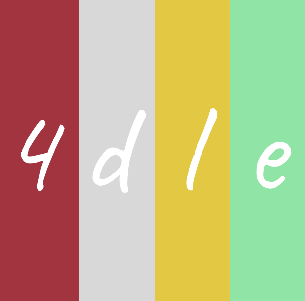
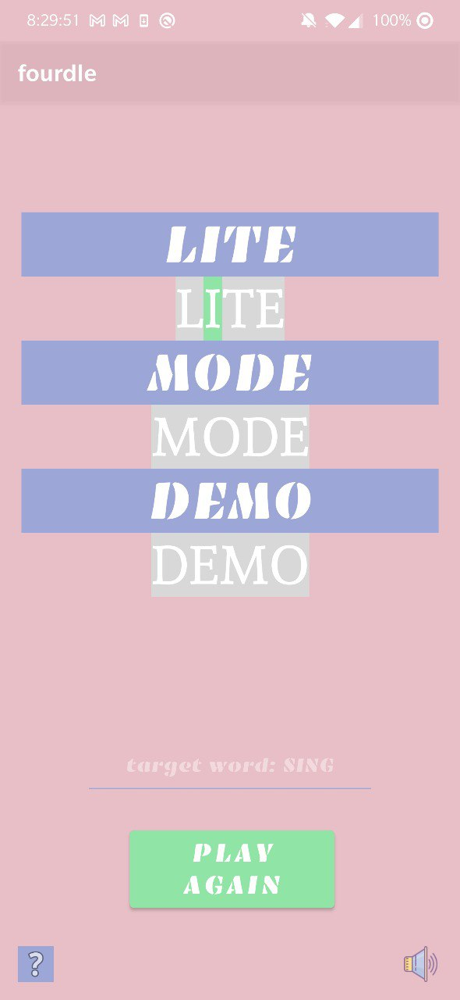
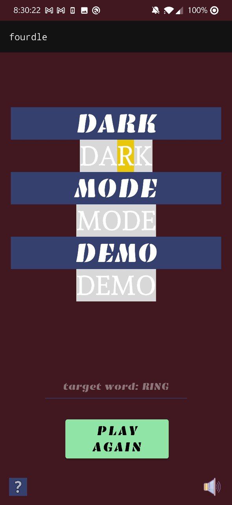

#  *fourdle*

**fordle** is an android app that puts a spin on the [popular](https://www.nytimes.com/2022/01/03/technology/wordle-word-game-creator.html) game [Wordle](https://www.nytimes.com/games/wordle/index.html). 

I made this project for [CodePath's](https://www.codepath.org/) [Android Development Pathway](https://www.codepath.org/courses/android-development)

This app is still a work in progress. A preview is given below. Look forward to a video demo soon. My final goal is to publish it on the [Google Play Store](https://play.google.com/store/games?hl=en_US&gl=US). Will update this README as progress is made. 

The following functionality is completed:

- [x] **User has 3 chances to guess a random 4 letter word**
- [x] **After 3 guesses, user should no longer be able to submit another guess**
- [x] **After each guess, user sees the "correctness" of the guess**
- [x] **After all guesses are taken, user can see the target word displayed**
* [x] Dynamic UI
* [x] Dark mode support
* [x] App icon
* [x] Splash screen
* [x] Advanced correctness indicator
* [x] Different music for different situations (win, loss, 3 lives, 2 lives, 1 life) -> TOTAL of 5 songs
* [x] Ability to turn on and off music  
* [x] Help screen

GIFs created with [ezgif](https://ezgif.com/video-to-gif)

## Launch

## Win

## Loss

## Error Checks

## Dark Mode Support

Light           |  Dark
:-------------------------:|:-------------------------:
  |  

## Credits

Coming soon

## License

    Copyright [2022] [Vasanth Banumurthy]

    Licensed under the Apache License, Version 2.0 (the "License");
    you may not use this file except in compliance with the License.
    You may obtain a copy of the License at

        http://www.apache.org/licenses/LICENSE-2.0

    Unless required by applicable law or agreed to in writing, software
    distributed under the License is distributed on an "AS IS" BASIS,
    WITHOUT WARRANTIES OR CONDITIONS OF ANY KIND, either express or implied.
    See the License for the specific language governing permissions and
    limitations under the License.
